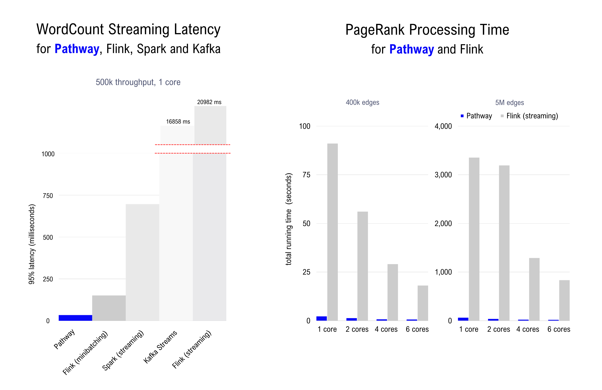
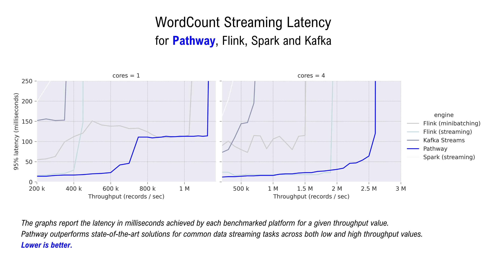
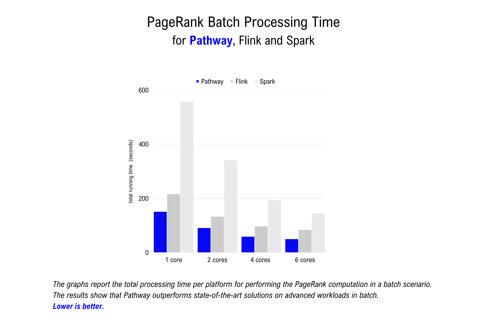
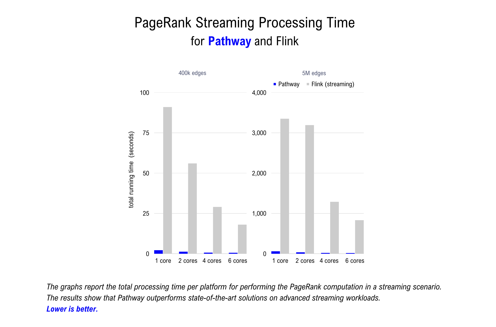

    

    
        
        
       
    
    

[Pathway](www.pathway.com) is a reactive data processing framework designed for high-throughput and low-latency realtime data processing. Pathway's unified Rust engine processes code seamlessly in both batch and streaming mode using the same Python API syntax. 

This repository contains benchmarks to compare the performance of Pathway against state-of-the-art technologies designed for streaming and batch data processing tasks, including Flink, Spark and Kafka Streaming. For a complete write-up of the benchmarks, read our corresponding [benchmarking article](www.pathway.com/blog/benchmarks).

The benchmarks are reproducible using the code in this repository. Find the instructions below under "Reproducing the benchmarks". 

## Benchmarks

The repository contains two types of benchmarks:

- The **WordCount Benchmark** reads words from the stream and stores the count of each word in the output stream. For the sake of output compaction, only changed entries are streamed. In this benchmark, a Kafka cluster is used for input and output.
- The **PageRank Benchmark** gets graph edges from the input stream, computes the PageRank of each node, and streams it to the output. In this benchmark, filesystem input and empty output are used.

The two benchmarks each represent a type of workload Pathway aims to support: online streaming tasks and graph processing tasks. The graph-processing benchmark (i.e. PageRank) is evaluated in three modes: batch, streaming, and a mixed batch-online mode we call backfilling which evaluates the ability of the engine to switch from batch to online mid-way.

For a full discussion of the results obtained, read our [benchmarking article](www.pathway.com/blog/streaming-benchmarks-pathway-fastest-engine-on-the-market).

## Machine specs

Below we present the results of the benchmarks. For these results, all benchmarks were run on dedicated machines with: 12-core AMD Ryzen 9 5900X Processor, 128GB of RAM and SSD drives. For all multithreaded benchmarks we explicitly allocate cores to ensure that threads maximally share L3 cache. This is important, as internally the CPU is assembled from two 6-core halves, and thread communication between halves is impacted. For this reason we report results on up to 6 cores for all frameworks.

All experiments are run using Docker, enforcing limits on used CPU cores and RAM consumption.

## Results

This section presents the results of the benchmarks. The results show that:
1. Pathway is on-par with or outperforms state-of-the-art solutions for common online streaming tasks (WordCount).
2. Pathway outperforms the other benchmarked engines for iterative graph processing tasks in **batch**.
3. Pathway outperforms the other benchmarked engines for iterative graph processing tasks in **streaming**.
4. Pathway is uniquely able to handle mixed **batch-and-streaming** workloads at scale.

### WordCount benchmark
The graph below shows results of the WordCount benchmark. 95% latency is reported in milliseconds (y-axis) per throughput value (x-axis). Out of the four tested solutions, Flink and Pathway are on-par, both clearly outperforming Spark Structured Streaming and Kafka Streams.

Pathway clearly outperforms the default Flink setup in terms of sustained throughput, and dominates the Flink minibatching setup in terms of latency for all of the throughput spectrum we could measure. For most throughputs, Pathway also achieves lower latency than the better of the two Flink setups.

### PageRank benchmark (batch)
The table below shows results of the PageRank benchmark in batch mode. We report the total running time
in seconds to process the dataset. The standard code logic is an idiomatic (join-based) implementation. Additionally, two incomparable implementations marked with (*) are benchmarked for Spark.

The fastest performance is achieved by the Spark GraphX implementation and the more aggressively-optimized Pathway build. The formulation (and syntax) of the GraphX algorithm is different from the others. Performing an apples-to-apples comparison of performance of equivalent logic in Table APIs, Pathway is the fastest, followed by Flink and Spark.

### PageRank benchmark (streaming)
The table below shows results of the PageRank benchmark in streaming mode. We report the total running time in seconds to process the dataset by updating the PageRank results every 1000 edges. 

We evaluate only two systems on the streaming PageRank task: Pathway and Flink. We don’t test Kafka Streams because it was suboptimal on the streaming wordcount task. Moreover, no Spark variant supports such a complicated streaming computation: GraphX doesn’t support streaming, Spark Structured Streaming doesn’t allow chaining multiple groupby’s and reductions, and Spark Continuous Streaming is too limited to support even simple streaming benchmarks.

We see that while both systems are able to run the streaming benchmark, Pathway maintains a large advantage over Flink. It is hard to say whether this advantage is “constant” (with a factor of about 50x) or increases “asymptotically” with dataset size. Indeed, extending the benchmarks to tests on larger datasets than those reported in Table 2 is problematic as Flink’s performance is degraded by memory issues.

### PageRank benchmark (backfilling)
The table below shows results of the PageRank benchmark in a backfilling scenario that mixes batch and streaming. 

Pathway again offers superior performance, completing the first of the datasets considered approximately 20x faster than Flink. The first large batch is processed by Pathway in times comparable to the pure batch scenario. 

For backfilling on the complete LiveJournal dataset, Flink either ran out of memory or failed to complete the task on 6 cores within 2 hours, depending on the setup.

For a full discussion of the results obtained, read our [benchmarking article](www.pathway.com/blog/streaming-benchmarks-pathway-fastest-engine-on-the-market).

The following sections contain information necessary for reproducing the benchmarks. 

## Reproducing the benchmarks

The repository provides a single Python script to run each benchmark:
- Execute the `run_wordcount.py` script in the `wordcount-online-streaming` directory to launch the WordCount benchmark on all tested solutions.
- Execute the `run_pagerank.py` script in the `pagerank-iterative-graph-processing` directory to launch the PageRank benchmark on all tested solutions. You will first need to download and preprocess the datasets (see below).

You will need a machine with at least 12 CPU cores to reproduce these benchmarks. Alternatively, you can edit the scripts mentioned above to run the benchmarks on a lower number of cores.

All benchmarks are run using Dockerized containers. Before launching the Python scripts, make sure you have the latest version of Docker installed and your Docker daemon is running. You may have to increase your allocated memory per container (at least 4GB per container) and allocate the necessary number of CPU cores to your Docker containers. 

## Accessing the datasets

### WordCount

The WordCount benchmarks are run on a dataset of 76 million words taken uniformly at random from a dictionary of 5000 random 7-lowercase letter words. We split the dataset into two parts: we use 16 million words as a burn-in period (to disregard high-latency at engine start-up) and we include only the latencies of the remaining 60 million words in the final results. The dataset is generated automatically when you run the `run_wordcount.py` script. 

Note that if your username has characters such as a dot or similar, you should add the USER= variable before launching, otherwise you may run into an error message because the `docker-compose` project name is built based on the username.

Results are stored in the `results` subdirectory.

### PageRank

The PageRank benchmarks are run on various subsets of the [Stanford LiveJournal dataset](https://snap.stanford.edu/data/soc-LiveJournal1.html). You can download and preprocess the datasets by running the `get_datasets.sh` script in the `pagerank-iterative-graph-processing/datasets` directory.

Results are stored in the `results` subdirectory.

### Dataset Citation

  author  = Jure Leskovec and Andrej Krevl,
  title   = SNAP Datasets: Stanford Large Network Dataset Collection,
  url     = http://snap.stanford.edu/data,
  month   = jun,
  year    = 2014

## Repository organization

The repository is structured as follows:

- `wordcount-online-streaming`, contains the scripts and files necessary to run the WordCount benchmark. This is where you will find the `run_wordcount.py` script to reproduce the benchmark yourself;
- `pagerank-iterative-graph-processing`, contains the scripts and files necessary to run the PageRank benchmark. This is where you will find the `run_pagerank.py` script to reproduce the benchmark yourself; 

